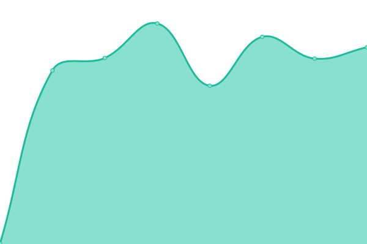

# [📈 Live Status](https://status.smart-oversight.com): <!--live status--> **🟩 All systems operational**

This repository contains the open-source uptime monitor and status page for [Smart Oversight](https://www.smart-oversight.com), powered by [Upptime](https://github.com/upptime/upptime).

With [Upptime](https://upptime.js.org), you can get your own unlimited and free uptime monitor and status page, powered entirely by a GitHub repository. We use [Issues](https://github.com/smart-oversight/smartoversight-status/issues) as incident reports, [Actions](https://github.com/smart-oversight/smartoversight-status/actions) as uptime monitors, and [Pages](https://status.smart-oversight.com) for the status page.

<!--start: status pages-->
<!-- This summary is generated by Upptime (https://github.com/upptime/upptime) -->
<!-- Do not edit this manually, your changes will be overwritten -->
<!-- prettier-ignore -->
| URL | Status | History | Response Time | Uptime |
| --- | ------ | ------- | ------------- | ------ |
|  [Smart Oversight Website](https://www.smart-oversight.com/) | 🟩 Up | [smart-oversight-website.yml](https://github.com/smart-oversight/smartoversight-status/commits/HEAD/history/smart-oversight-website.yml) | 

 1347ms
     
 | 

<a href="https://status.smart-oversight.com/history/smart-oversight-website">100.00%</a>
    

|  [So Comply Luxembourg](https://app-lux.so-comply.com/) | 🟩 Up | [so-comply-luxembourg.yml](https://github.com/smart-oversight/smartoversight-status/commits/HEAD/history/so-comply-luxembourg.yml) | 

 690ms
     
 | 

<a href="https://status.smart-oversight.com/history/so-comply-luxembourg">100.00%</a>
    

|  [So Comply Luxembourg Api](https://api-lux.so-comply.com/v1/health-check) | 🟩 Up | [so-comply-luxembourg-api.yml](https://github.com/smart-oversight/smartoversight-status/commits/HEAD/history/so-comply-luxembourg-api.yml) | 

 745ms
     
 | 

<a href="https://status.smart-oversight.com/history/so-comply-luxembourg-api">100.00%</a>
    

|  [So Comply Europe](https://app.so-comply.com/) | 🟩 Up | [so-comply-europe.yml](https://github.com/smart-oversight/smartoversight-status/commits/HEAD/history/so-comply-europe.yml) | 

 690ms
     
 | 

<a href="https://status.smart-oversight.com/history/so-comply-europe">100.00%</a>
    

|  [So Comply Europe Api](https://api.so-comply.com/v1/health-check) | 🟩 Up | [so-comply-europe-api.yml](https://github.com/smart-oversight/smartoversight-status/commits/HEAD/history/so-comply-europe-api.yml) | 

 703ms
     
 | 

<a href="https://status.smart-oversight.com/history/so-comply-europe-api">100.00%</a>
    

|  [So Comply Switzerland](https://app-swiss.so-comply.com/) | 🟩 Up | [so-comply-switzerland.yml](https://github.com/smart-oversight/smartoversight-status/commits/HEAD/history/so-comply-switzerland.yml) | 

 741ms
     
 | 

<a href="https://status.smart-oversight.com/history/so-comply-switzerland">100.00%</a>
    

|  [So Comply Switzerland Api](https://api-swiss.so-comply.com/v1/health-check) | 🟩 Up | [so-comply-switzerland-api.yml](https://github.com/smart-oversight/smartoversight-status/commits/HEAD/history/so-comply-switzerland-api.yml) | 

 818ms
     
 | 

<a href="https://status.smart-oversight.com/history/so-comply-switzerland-api">100.00%</a>
    

<!--end: status pages-->

[**Visit our status website →**](https://status.smart-oversight.com)

## 📄 License

- Powered by: [Upptime](https://github.com/upptime/upptime)
- Code: [MIT](./LICENSE) © [Smart Oversight](https://www.smart-oversight.com)
- Data in the `./history` directory: [Open Database License](https://opendatacommons.org/licenses/odbl/1-0/)
